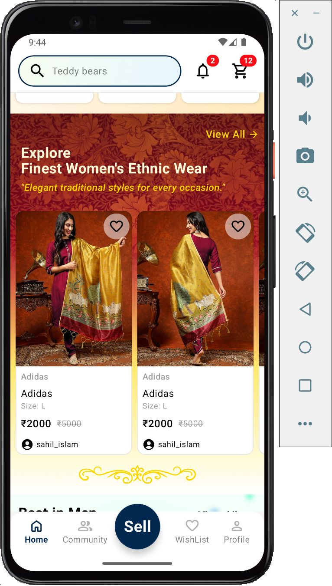

# 🔁 LocalLoop

**LocalLoop** is a sleek and intuitive platform designed for local communities to **buy, sell, and exchange items** with ease. Whether you're decluttering your space or hunting for great deals, LocalLoop bridges the gap between neighbors through trusted, location-based commerce.

---

## 🚀 Features

* 📍 **Geo-Tagged Listings** – Discover products listed in your vicinity.
* 🛍️ **Effortless Selling** – Post items with just a few taps.
* 🔐 **Built-in Chat** – Securely communicate with buyers and sellers.
* 📸 **Multi-Image Uploads** – Showcase your product with clarity.
* 🧠 **Smart Filters** – Easily browse by category, price, or distance.
* 🧾 **Listing History** – Track your past listings and favorites.

---

## 📸 Screenshots
<table>
  <tr>
    <td></td>
    <td></td>
  </tr>
</table>

---

## 🛠️ Tech Stack

  
  
  

  
  
  

---

## 📄 License

Distributed under the MIT License. See [LICENSE](LICENSE) for more information.

---

## 🙌 Acknowledgments

* Icons by [FlatIcons](https://www.flaticon.com/authors/flat-icons/)
* UI inspiration from community-driven marketplaces

---

> Built with ❤️ to prototype an empowerment towards local commerce.
